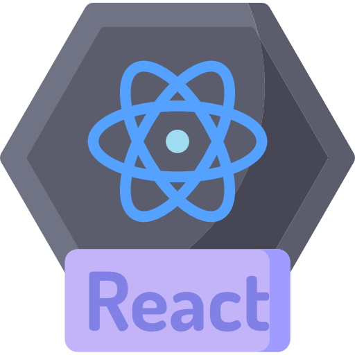

---

← [Back to Section Index](index.md) | [Next Topic →](02-llms-work.md)

---

[← Main Index](../index.md) → [Section Index](index.md) → **Bootstrapping Your Environment**

---

# Bootstrapping Your Environment

> **Install and verify the terminal, Python, VS Code, Git, and Node.js — the five tools every AI agent developer uses.**

This page walks you through installing each tool, checking that it works, and confirming your setup is ready for the rest of the learning path.

## 📺 Recommended Videos

1. [Linux Terminal for Beginners](https://www.youtube.com/watch?v=5XgBd6rjuDQ) — opening the terminal, navigating folders, and running basic commands
2. [Linux Command Line Basics](https://www.youtube.com/watch?v=10f4899srvc) — the most common commands you will type every day
3. [Mastering the Terminal](https://www.youtube.com/watch?v=16d2lHc0Pe8) — shortcuts and productivity tips for faster work
4. [Python for Beginners](https://www.youtube.com/watch?v=7IoQ5BGkTJo) — installing Python and running your first script
5. [Python Variables and Data Types](https://www.youtube.com/watch?v=8uxIm23JJNY) — understanding how Python stores and works with data
6. [Python Functions and Modules](https://www.youtube.com/watch?v=94UHCEmprCY) — organizing code into reusable pieces
7. [Complete Python Course](https://www.youtube.com/watch?v=ES82kgVf7-4) — a longer walkthrough of core Python concepts
8. [Object-Oriented Python](https://www.youtube.com/watch?v=IAXhhXQI3qTQ) — classes and objects, useful when writing agent tools

## Understanding Your Development Environment

### What Is a Terminal?

- A **terminal** is a text-based program that lets you talk directly to your computer's operating system
- Instead of clicking icons and menus, you type commands and press Enter
- AI agents use the terminal all the time: they run scripts, install packages, and check results — all through terminal commands

> 🖥️ **Why terminals matter:** Every AI coding agent (OpenCode, Claude Code, OMP) works by sending commands to your terminal. Understanding what those commands do makes you a better agent user.

### Why Each Tool Matters

| Tool | Used For | In This Learning Path |
|---|---|---|
| **Terminal** | Running commands, navigating files | Every page — it's your control panel |
| **Python** | Writing scripts, calling AI APIs, data processing | Talking to OpenAI/Anthropic APIs, running local models |
| **VS Code** | Writing and editing code with helpful hints | All coding tasks, agent configuration |
| **Git** | Saving versions of your code, sharing on GitHub | Deploying projects, tracking changes, collaboration |
| **Node.js** | Running JavaScript tools and web apps | MCP servers, agent extensions, frontend projects |

> 
> *The terminal is your direct line to the operating system.*

## Step-by-Step Guide

### Step 1: Open Your Terminal

**On macOS:**
- Open the **Terminal** app
  - Press `Cmd + Space`, type "Terminal", press Enter
  - Or open Finder → Applications → Utilities → Terminal

**On Windows:**
- Open **Windows Terminal** (recommended) or **Command Prompt**
  - Press `Win + X`, choose "Windows Terminal"
  - Or search "Terminal" in the Start menu
- If you do not have Windows Terminal, download it free from the Microsoft Store

**On Linux:**
- Open your terminal emulator
  - GNOME: Ctrl + Alt + T
  - Most Linux distros have a terminal in the Applications menu

### Step 2: Learn Terminal Basics

Try these commands (type them and press Enter):

```bash
# Where am I right now?
pwd

# What files are in this folder?
ls

# Move into a folder
cd Documents

# Go back to the previous folder
cd ..

# Make a new folder
mkdir my-project
```

**What to expect:**
- `pwd` prints the full path of the folder you are in (like `/Users/yourname/Documents`)
- `ls` lists every file and folder in your current location
- `cd` changes which folder you are in

> ❌ **Common mistake:** Forgetting to put a space after `cd`. `cdDocuments` (no space) does not work. Always use `cd Documents`.

> 🐍 **Python** is the language you will use to write scripts, call AI APIs, and process data.
> 

### Step 3: Install Python

**Check if Python is already installed:**

```bash
python3 --version
# or on Windows:
python --version
```

If you see a version number like `Python 3.12.0`, you are good to go.

**If Python is not installed:**

- **macOS:** Install via [python.org](https://www.python.org/downloads/) or use Homebrew:
  ```bash
  brew install python3
  ```
- **Windows:** Download from [python.org](https://www.python.org/downloads/) and run the installer. Check "Add Python to PATH" during installation.
- **Linux:** Most Linux distros already have Python 3. If not:
  ```bash
  sudo apt update && sudo apt install python3 python3-pip
  ```

**Verify the installation:**

```bash
python3 --version
pip3 --version
```

> 💡 **Tip:** Use `python3` (not `python`) on macOS and Linux. On Windows, `python` usually works.

> 📦 **Git** lets you save snapshots of your code, undo mistakes, and share your work on GitHub.
> 

### Step 4: Install Git

**Check if Git is already installed:**

```bash
git --version
```

If you see something like `git version 2.43.0`, Git is installed.

**If Git is not installed:**

- **macOS:** Install via the App Store (Xcode Command Line Tools) or [git-scm.com](https://git-scm.com/download/mac)
  ```bash
  git --version  # If this asks you to install Xcode tools, say yes
  ```
- **Windows:** Download from [git-scm.com](https://git-scm.com/download/win). Run the installer with default settings.
- **Linux:**
  ```bash
  sudo apt update && sudo apt install git
  ```

### Step 5: Install VS Code

- Go to [code.visualstudio.com](https://code.visualstudio.com/)
- Download the installer for your operating system and run it
- Open VS Code after installation

**Install the Python extension:**

1. Click the **Extensions** icon on the left sidebar (or press `Ctrl + Shift + X`)
2. Search for "Python" (by Microsoft) and click **Install**
3. Also install the **GitLens** extension (search "GitLens") — it makes Git history easy to read

> 🖥️ **VS Code tip:** Open a folder in VS Code (`File → Open Folder`), then right-click any Python file and choose "Run Python File in Terminal" to test your setup.

> ⬢ **Node.js** runs JavaScript outside your browser. Many AI agent tools are built with it.
> 

### Step 6: Install Node.js

**Check if Node.js is installed:**

```bash
node --version
npm --version
```

**If Node.js is not installed:**

- Go to [nodejs.org](https://nodejs.org/)
- Download the **LTS** (Long Term Support) version
- Run the installer (it also installs `npm`, the Node package manager)

**Verify the installation:**

```bash
node --version
npm --version
```

You should see two version numbers, like `v20.11.1` and `10.2.3`.

### Step 7: Verify Everything Works

Run through this checklist in your terminal:

```bash
# 1. Your terminal works
echo "All set up!"

# 2. Python works
python3 --version

# 3. Git works
git --version

# 4. Node.js works
node --version
npm --version
```

Every command should print something without errors. If any command fails:

- Go back to the relevant step above
- Check that you checked the "Add to PATH" box during installation (Windows)
- Restart your terminal after installing (close and reopen it)

> 🖥️ **VS Code screenshot**
> 
> *VS Code will be your primary code editor throughout this path.*

## Common Pitfalls

- ❌ **Forgetting to check "Add to PATH" (Windows)** — The installer gives you this checkbox. If you skip it, `python`, `git`, and `node` commands will not work in a new terminal window. Uninstall and reinstall with the box checked.
- ❌ **Using `python` instead of `python3`** — On macOS and most Linux systems, `python` may point to Python 2 (which is outdated). Always use `python3`.
- ❌ **Not restarting the terminal after install** — Your terminal only checks for new programs when it starts. Close it and open a new one after installing anything.
- ❌ **Installing the "Current" Node.js instead of "LTS"** — The LTS version is more stable and what most tutorials assume. Always pick the LTS installer from nodejs.org.
- ❌ **VS Code shows a pop-up asking to select a Python interpreter** — This happens because VS Code found multiple Python versions. Choose the one you just installed (usually the one with the highest version number).

## Quick Reference

| Command | What It Does |
|---|---|
| `pwd` | Print the current folder path |
| `ls` | List files in the current folder |
| `cd <folder>` | Change to a different folder |
| `cd ..` | Go up one folder level |
| `mkdir <name>` | Create a new folder |
| `python3 --version` | Check Python version |
| `git --version` | Check if Git is installed |
| `node --version` | Check Node.js version |
| `npm --version` | Check npm version |
| `echo "text"` | Print text to the terminal |

## Key Takeaways

- The **terminal** is your control panel — you will use it every day
- **Python 3** is required; always use `python3` on macOS/Linux
- **Git** lets you save your work and share it on GitHub
- **VS Code** is a free editor that works great with Python and Git
- **Node.js LTS** runs the JavaScript tools behind many AI agent features

## 📚 Recommended Reading (Web Links)

1. [LinuxCommand.org](https://linuxcommand.org/) — The Linux Command Line book and tutorials (free to read online)
2. [freeCodeCamp Command Line Basics](https://www.freecodecamp.org/news/command-line-for-beginners/) — A beginner-friendly command line crash course
3. [Python.org Tutorial](https://docs.python.org/3/tutorial/) — Official Python tutorial (start with "Getting Started")
4. [Real Python](https://realpython.com/) — In-depth Python guides and tutorials
5. [Git - Book](https://git-scm.com/book/en/v2) — The free, online Git book (covers setup and daily use)

---

← [Back to Section Index](index.md) | [Next Topic →](02-llms-work.md)

[← Main Index](../index.md) | [Table of Contents](index.md)
