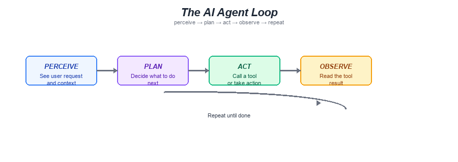
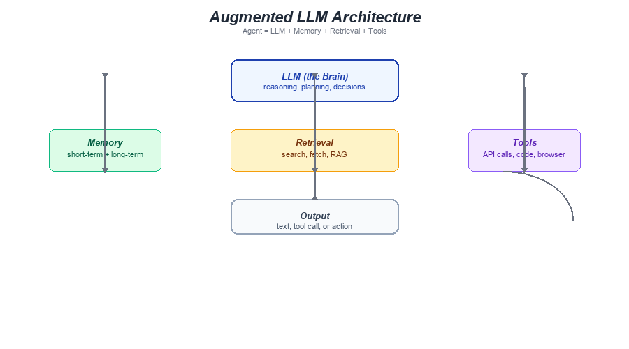

---

← [Back to Section Index](00-index.md) | [Next Topic →](02-custom-agents.md)

---

[← Main Index](../00-index.md) → [Section Index](00-index.md) → **How Agents Are Built**

---

# How Agents Are Built: The Agent Loop, Tools, Memory & Planning

> **Every AI agent runs the same loop: perceive a task, plan steps, act with tools, observe results, and repeat. This page breaks down each piece.**

An agent is not a single model call. It is a *loop* — a process that keeps going until the task is done. In this page you will trace that loop from the inside, understand how tools let the agent act on the world, see how memory works across short and long timeframes, and learn two ways to plan.

## 📺 Recommended Videos

1. [Agentic Framework LangGraph explained in 8 minutes | Beginners Guide](https://www.youtube.com/watch?v=1Q_MDOWaljk) — What a "graph" is in agent frameworks and how nodes/edges drive the loop
2. [AutoGen vs CrewAI vs LangGraph – Best AI Agent Framework In 2025!](https://www.youtube.com/watch?v=8HqeY5v0ohM) — A side-by-side comparison of the three major Python frameworks for building agents
3. [Agentic AI Tutorial for Beginners | Langgraph Tutorial](https://www.youtube.com/watch?v=CnXdddeZ4tQ) — A hands-on walkthrough of building an agent with a graph-based loop

## Understanding the Agent Loop

### What Is It?

An **agent** is an LLM that can use tools and decides dynamically how to reach a goal — one step at a time. Contrast this with a **workflow**, which is a fixed sequence of steps written by a developer.

Think of it like cooking:

- A **workflow** is a recipe — you follow step 1, then step 2, then step 3. Each step is predetermined.
- An **agent** is a chef who looks in the fridge, decides what they are missing, checks the pantry, and adapts the recipe as they go.

The agent loop has four stages that repeat until the job is done:

> 
> *The perceive → plan → act → observe cycle repeats until the task completes.*

1. **Perceive** — the agent reads the user's request (and any prior context).
2. **Plan** — the agent decides what to do next. This might be a long reasoning sequence inside the model ("I need to search the web, then read the results, then write a file").
3. **Act** — the agent executes a tool call (search, read a file, run code, etc.).
4. **Observe** — the agent reads the tool's return value and decides: is the task done, or should I loop again?

> 🤖 **Why the loop matters:** Without it, an agent can only do one thing per conversation turn. The loop is what lets it tackle multi-step tasks like "research a topic, summarize it, and write a report" — breaking the task down as it goes.

### Why You Need This

- **Debugging:** When an agent gets stuck in a loop, you now know where to look — is it planning poorly, or is a tool returning confusing results?
- **Prompt design:** Knowing the agent perceives the tool output helps you write prompts that tell it *what to do with* the results, not just *what to search for*.
- **Cost awareness:** Each loop iteration costs tokens. Understanding the loop helps you write constraints that keep it efficient.

## Step-by-Step Guide

### Step 1: See the Loop in Python

Here is the minimal agent loop in pure Python. It shows the four stages without any specific framework:

```python
def agent_loop(user_request, tools, model):
    """A minimal agent loop: plan → act → observe → repeat."""
    history = [{"role": "user", "content": user_request}]

    while True:
        # PLAN: ask the model what to do next
        response = model.chat(history)

        if response.is_done:
            return response.text  # task complete

        # ACT: execute the tool call the model chose
        tool_result = tools[response.tool_name](**response.tool_args)

        # OBSERVE: feed the result back and loop again
        history.append({"role": "assistant", 
                        "content": response.raw, 
                        "tool_results": tool_result})
```

**What to expect:**
- The `history` list grows every iteration — that is the agent's short-term memory
- The model decides both *what* to do and *when* to stop
- If the model calls a tool every time, the loop never ends — that is why real agents add a max-iterations safety limit

> 💡 **Tip:** Every framework (smolagents, LangGraph, OpenAI Assistants) implements this same loop. They just wrap it differently — a state machine, a graph, or a managed thread. The core idea is always: **model decides → tool runs → result feeds back**.

### Step 2: Understand Tool Calling

Tools are how an agent acts on the world. A tool is just a function with a description the model can read:

```json
{
  "name": "search_web",
  "description": "Search the web for current information",
  "parameters": {
    "query": {"type": "string", "description": "What to search for"}
  }
}
```

When the model wants to use a tool, it outputs something like:

```
I'll search the web to find recent AI news.
[tool_call] search_web: {"query": "latest ai agent news 2025"}
```

The agent then runs `search_web(query="latest ai agent news 2025")`, gets back results, and feeds them into the next loop iteration.

**How tools connect (MCP):**

> 
> *An agent is an LLM augmented with memory, retrieval, and tools — all feeding into the same loop.*

The **Model Context Protocol (MCP)** — which you practiced in Section 3 — is the standard way to connect tools to an agent. An MCP server exposes tools, resources, and prompts that any MCP-compatible agent (OpenCode, OMP) can discover and call.

### Step 3: Learn How Memory Works

Agents juggle two kinds of memory:

| Memory Type | Where It Lives | What It Does | Limits |
|---|---|---|---|
| **Short-term memory** | The conversation history (context window) | Remembers what happened earlier *in this session* | Tokens run out — the agent "forgets" |
| **Long-term memory** | Files, databases, vector stores | Stores facts, notes, and knowledge across sessions | Unlimited, but the agent must *search* to recall |

**Short-term memory** is just the chat history. Every message — user request, tool result, the agent's own reply — gets appended. When the context window fills up, the oldest messages are cut off. This is why very long conversations can cause an agent to "forget" earlier instructions.

**Long-term memory** is anything the agent can read back. In OpenCode and OMP this is typically:

- **Files on disk** — the agent writes `.md` notes and reads them back later
- **Git history** — the agent can `git log` to see what changed and when
- **Vector stores** — for semantic search over large document collections (you will use this in the RAG projects)

> 🤖 **Why memory matters:** An agent with only short-term memory can solve a single task. An agent with long-term memory can *learn* — it remembers your preferences, past decisions, and results across projects.

### Step 4: Choose a Planning Strategy

The agent's plan can come from two places:

**LLM-based planning** — the model reasons internally about what steps to take. This is what happens when you ask an agent to "research X, then write a report." The model breaks the task into sub-steps on its own.

**Fixed workflows** — you (the developer) write the steps in code, and the model executes them one at a time. This is what prompt chaining does: `search → summarize → write`.

| Strategy | How It Works | Pros | Cons |
|---|---|---|---|
| LLM-based | Model decides each step | Handles surprises well | Can loop forever or waste tokens |
| Fixed workflow | Developer writes the steps | Predictable, fast, cheap | Can't adapt to new situations |

> 💡 **Tip:** Start with a fixed workflow for predictable tasks (e.g., "always search → summarize → write"). Use LLM-based planning for open-ended tasks where you can't predict the path (e.g., "debug this codebase — it could be 1 or 20 files").

### Step 5: Compare Agent Frameworks

Different frameworks implement the same loop with different trade-offs. Here is a quick reference:

| Framework | Where the Loop Lives | Memory Strategy | Best For |
|---|---|---|---|
| **OpenCode** (built-in) | CLI loop | File system + context | Coding tasks, single-repo |
| **Oh My Pi (OMP)** | YAML-driven multi-agent | Config inheritance + files | Multi-agent workflows, team agents |
| **LangGraph** | Graph of nodes + state | State schema + checkpointers | Complex orchestration, persistence |
| **smolagents** | Python while-loop | In-memory + files | Lightweight, educational projects |
| **LlamaIndex** | Workflow event system | Indexes + query engines | Data-heavy RAG agents |

> 🤖 **Note:** All of these frameworks wrap the same four stages. The differences are in *how* state is stored (context, files, databases), *how* tools are discovered (hardcoded, MCP, LlamaHub), and *how* the loop is expressed (function, graph, events).

## Common Pitfalls

- ❌ **Treating every task as an agent task** — Many problems are simple enough for a single LLM call. Agents add cost and complexity. Ask: "Can I solve this with a well-written prompt and retrieval?" before reaching for an agent.
- ❌ **Unlimited loops** — An agent can call tools forever if you do not cap iterations. Always set a max-turns or max-iterations limit (e.g., 10–20 steps).
- ❌ **Poorly described tools** — If the tool's description is vague, the model will call it at the wrong time or with wrong arguments. Write clear descriptions like docstrings for a junior developer.
- ❌ **Ignoring context limits** — Long-running agents fill up the context window. If you do not trim history, the model starts dropping important information.
- ❌ **No ground truth from tools** — An agent that plans but never checks results will drift. Always make sure the agent *observes* the output of its tool calls before deciding the next step.

## Quick Reference

| Concept | Key Idea |
|---|---|
| **Agent loop** | perceive → plan → act → observe → repeat |
| **Tool calling** | Model outputs a tool name + JSON args; your code runs it |
| **Short-term memory** | Conversation history in the context window |
| **Long-term memory** | Files, databases, vector stores the agent can search |
| **LLM planning** | Model decides steps — flexible but can run long |
| **Fixed workflow** | Developer writes steps — predictable but rigid |
| **Agent vs workflow** | Agent = model chooses path; workflow = code chooses path |

## Key Takeaways

- An **agent** is an LLM that uses tools in a loop — it plans, acts, observes, and repeats until done
- The loop is **universal** — OpenCode, OMP, LangGraph, and smolagents all implement the same four stages
- **Tools** are functions with clear descriptions; MCP (from Section 3) is how you connect them
- **Memory** has two layers: short-term (context window, gets truncated) and long-term (files, databases, always available)
- **Planning** can be LLM-based (flexible) or fixed (predictable) — choose based on whether you can predict the steps
- Start simple: a well-written prompt with retrieval often beats a complex agent

## 📚 Recommended Reading (Web Links)

1. [Hugging Face AI Agents Course — Unit 1: Agent Fundamentals](https://huggingface.co/learn/agents-course/en/unit1/introduction) — Free certified course covering the agent loop, tools, memory, and planning
2. [Anthropic: Building Effective Agents](https://resources.anthropic.com/building-effective-ai-agents) — Research-backed guide on agent architecture, workflows vs agents, and tool design best practices
3. [LangChain: LangGraph Conceptual Guide](https://python.langchain.com/docs/concepts/architecture/) — Agent = Model + Harness; how LangGraph adds durable execution and persistence
4. [OpenAI: Assistants API](https://platform.openai.com/docs/assistants) — How agent loops with tools are implemented in a managed API (threads, runs, tools)
5. [Hugging Face: smolagents Documentation](https://huggingface.co/docs/smolagents) — Lightweight Python library for building agents with a simple while-loop

---

← [Back to Section Index](00-index.md) | [Next Topic →](02-custom-agents.md)

[← Main Index](../00-index.md) | [Table of Contents](00-index.md)
