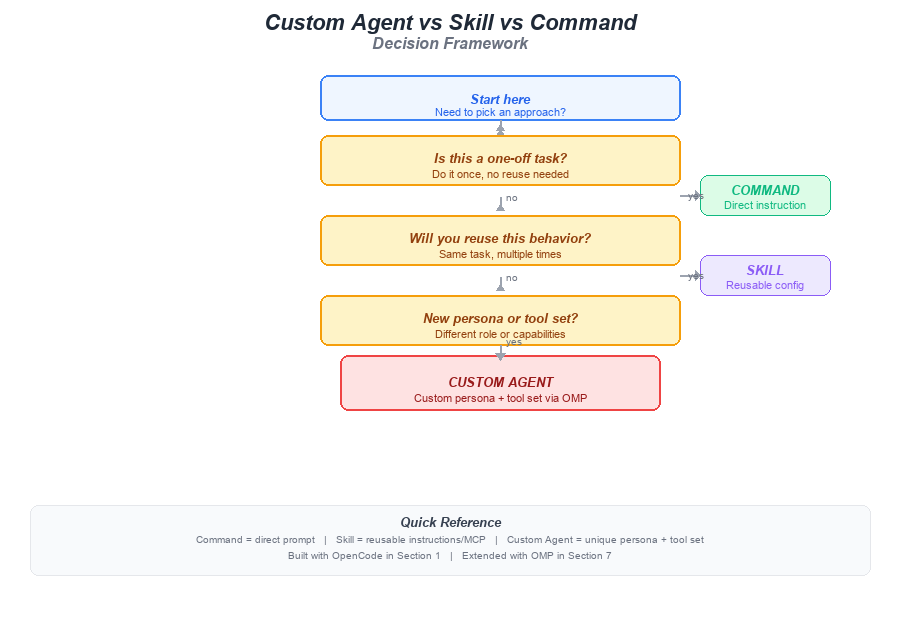

---

← [Back to Section Index](00-index.md) | ← [Previous Topic](02-custom-agents.md)

---

[← Main Index](../00-index.md) → [Section Index](00-index.md) → **Agents vs Skills vs Commands**

---

# Agents vs Skills vs Commands: The Decision Table

> **Before you write a single line of config, decide: command, skill, or custom agent?**

Every task you give an AI agent falls into one of three buckets. Choosing the right one saves time, reduces confusion, and keeps your setup maintainable. This page gives you a simple decision table and explains the trade-offs for each choice.

## 📺 Recommended Videos

1. [Agentic Framework LangGraph explained in 8 minutes | Beginners Guide](https://www.youtube.com/watch?v=1Q_MDOWaljk) — How graph-based frameworks structure agent logic
2. [AutoGen vs CrewAI vs LangGraph – Best AI Agent Framework In 2025!](https://www.youtube.com/watch?v=8HqeY5v0ohM) — Comparison of Python frameworks for building agents
3. [Agentic AI Tutorial for Beginners | Langgraph Tutorial](https://www.youtube.com/watch?v=CnXdddeZ4tQ) — Hands-on example of building an agent with tools

## Understanding the Three Approaches

### What Are the Three?

| Approach | What It Is | File Location | Reuse |
|---|---|---|---|
| **Command** | A direct prompt you type at the agent — no saved config | None (typed live) | One-time |
| **Skill** | A saved prompt template or MCP server you activate on demand | `~/.opencode/` or `.omp/skills/` | Across sessions |
| **Custom Agent** | A full persona + tool set + instructions saved as YAML | `~/.omp/config.yaml` or `.omp/config.yaml` | Across sessions and projects |

Here is a visual decision framework:

> 
> *A flowchart: is it a one-off task? → Command. Reusable behavior? → Skill. New persona or tools? → Custom Agent.*

### Why You Need This

- **Commands** are fastest to start but disappear when the session ends — you re-type the same instructions every time
- **Skills** are great for reusable behaviors but share the same default persona — they can't give the agent a new personality
- **Custom agents** give you a named persona with its own tools, but they take more setup

Choosing wrong costs you: a task that should be a one-line command gets saved as a skill "just in case," and a year later you have 50 unused skills. Or, you keep re-typing the same prompt because you never saved it as a skill.

## Step-by-Step Guide

### Step 1: Use the Decision Table

Check your scenario in the table. If multiple rows apply, pick the *most specific* one:

| Scenario | Choose | Reason |
|---|---|---|
| One-off task, never again | **Command** | No need to save anything |
| Repeatable behavior, same persona | **Skill** | Reusable instructions without extra setup |
| Repeatable behavior, need custom instructions only | **Skill** *or* **Custom Agent** | Skill if lightweight; agent if persona matters |
| New persona (different role, tone, or expertise) | **Custom Agent** | The agent needs a distinct personality |
| Need a different tool set | **Custom Agent** | Skills can't restrict which tools an agent uses |
| Need different MCP servers | **Custom Agent** | Agent-level tool config overrides the default |
| Multi-agent collaboration (parent + child) | **Custom Agent** | OMP multi-agent sessions require named agents |
| Debugging or exploring code | **Command** | Fast, no setup, throwaway context |
| Generating reports with the same template | **Skill** | Template reuse, same agent persona |
| Acting as a code reviewer with a strict checklist | **Custom Agent** | Needs a distinct persona ("senior reviewer") + specific tools |

### Step 2: See Each Approach in Practice

**Command** — just type and go:

```
> /analyze "Explain how vector databases work in 3 paragraphs"
```

No config file. No installation. The prompt lives only in the chat history.

**Skill** — save a reusable prompt template (in OpenCode or OMP):

```
# skills/code-review.md
Act as a senior code reviewer. For every file:
1. Check for security issues first
2. Check for correctness bugs
3. Check for readability
Output in Markdown with ### headers for each file.

Usage: /run-skill code-review <file>
```

The skill is reusable across sessions. But it shares your default agent persona ("helpful coding assistant").

**Custom Agent** — define a full persona + tools in OMP YAML:

```yaml
# .omp/config.yaml
agents:
  code-reviewer:
    persona: |
      You are a senior security engineer reviewing code. You flag every
      security risk with a CVSS score and a specific fix. You never
      approve code with critical or high vulnerabilities.
    model: openrouter/anthropic/claude-3.5-sonnet
    tools:
      - file-read
      - bash  # for running linters
    instructions:
      - "Run bandit for Python security scanning"
      - "Check for hardcoded secrets"
      - "Output a risk table first, then per-line comments"
    max_iterations: 10
```

Then invoke it:

```bash
omp run --agent code-reviewer "Review the auth module of this project"
```

### Step 3: Compare the Trade-offs

| | **Command** | **Skill** | **Custom Agent** |
|---|---|---|---|
| Setup effort | None | Low — write a template | Medium — write YAML config |
| Persona control | None | None (shared default) | Full (you define the role + tone) |
| Tool control | Full (default set) | None (shared default) | Full (you pick the tools) |
| Reusable | No | Yes | Yes |
| Shareable | No | Yes (file export) | Yes (commit YAML to Git) |
| Best for | One-off, exploratory tasks | Repeated behavior, same persona | Specialized roles, multi-agent workflows |

### Step 4: Migration Path

You do not have to start at the top of the complexity ladder. Many teams follow this migration path:

1. **Week 1:** Use commands for everything — get comfortable with prompts
2. **Week 3:** Save your most-used prompts as skills — stop re-typing the same instructions
3. **Week 5+:** Define custom agents in OMP for specialized roles (Reviewer, Researcher, Deployment)

> 💡 **Tip:** A skill you use frequently is a sign you need a custom agent. If you find yourself always adding "act like a security reviewer" to the same skill, it is time to promote it to an agent.

## Common Pitfalls

- ❌ **Saving everything as a skill** — Skills are meant for genuinely reusable behavior. Saving a one-off prompt "just in case" creates clutter that is harder to search through later.
- ❌ **Skills with conflicting personas** — If two skills both try to redefine the agent's tone ("act like a pirate" and "act like a lawyer"), they conflict. Keep personality in the agent config, not in skill files.
- ❌ **Custom agents with the default tool set** — If all your agents have the same tools, you lose the benefit of specialization. Restrict each agent's tools to what its role needs.
- ❌ **Skipping the command stage** — New users jump straight to custom agents and get overwhelmed by YAML. Start with commands; the concepts transfer.
- ❌ **No naming convention** — If your agents are named `agent1`, `agent2`, and `my-agent`, you will forget which is which. Use descriptive names like `security-reviewer`, `research-analyst`, `deployment-engineer`.

## Quick Reference

| Use Case | Approach | Setup Location |
|---|---|---|
| Debug a quick error | Command | Type directly |
| Repeatable code review | Skill | `skills/code-review.md` |
| Research persona with web search | Custom Agent | `.omp/config.yaml` |
| Multi-agent workflow | Custom Agent | `~/.omp/config.yaml` |
| Team-shared deployment agent | Custom Agent | `.omp/config.yaml` (committed to Git) |

## Key Takeaways

- **Command** = a prompt you type once. Fast, no setup, not reusable.
- **Skill** = a saved prompt template you activate on demand. Reusable behavior, same agent persona.
- **Custom Agent** = a full persona + tool set + instructions in a YAML config. Reusable personality and capabilities.
- Use the **decision table** to pick the simplest approach that solves your problem.
- **Migrate up** the ladder: commands → skills → custom agents as your needs grow.
- Always **name your agents descriptively** and **restrict their tools** to what their role needs.

## 📚 Recommended Reading (Web Links)

1. [Anthropic: Building Effective Agents](https://resources.anthropic.com/building-effective-ai-agents) — When to use agents vs workflows, and principles for agent design
2. [Hugging Face AI Agents Course — Unit 2: Frameworks](https://huggingface.co/learn/agents-course/en/unit2/introduction) — When to use an agentic framework, and comparison of smolagents, LlamaIndex, and LangGraph
3. [LangChain: LangGraph Overview](https://python.langchain.com/docs/concepts/architecture/) — Agent = Model + Harness; when to use LangGraph vs LangChain vs Deep Agents
4. [OMP Skills Marketplace](https://omp.ohmy.tools/skills) — Finding, installing, and sharing OMP skills
5. [OMP Agent Configuration Guide](https://omp.ohmy.tools/config) — Full YAML schema reference for custom agents

---

← [Back to Section Index](00-index.md) | ← [Previous Topic](02-custom-agents.md)

[← Main Index](../00-index.md) | [Table of Contents](00-index.md) | [Next Section: Use Cases →](../06-use-cases/00-index.md)
