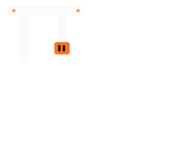

<!-- Navigation: Top -->
← [Previous Section](../07-assignments/index.md) | [01. Why OMP →](01-why-omp.md)

<!-- Navigation: Breadcrumb -->
[← Main Index](../index.md) → [Section 7: Oh My Pi (OMP)](index.md)

---

# Section 7: Oh My Pi (OMP)

> **Estimated time:** 4–5 hours | **Goal:** Master OMP's advanced features: global config, hooks, subagents, multi-agent workflows, and cost tracking.

After building foundational skills with OpenCode and completing the assignment exercises, this section dives into **Oh My Pi (OMP)** — a free, open-source coding agent that extends the Claude Code experience with built-in multi-provider support, IDE-quality diagnostics (LSP/DAP), and a declarative configuration system.

OMP can be installed via `curl`, Homebrew, or `bun install -g @oh-my-pi/pi-coding-agent`. It discovers existing agent configs (`.claude`, `.gemini`, `opencode`, etc.) and can run in **adapter mode** to let Claude Code, Codex, Gemini, or Cursor read OMP-style configuration.

---

## What's in This Section?

| Topic | Description | Duration |
|-------|-------------|----------|
| [01. Why OMP?](./01-why-omp.md) | Comparison against OpenCode and Claude Code; where OMP shines. | 30 min |
| [02. Installing OMP](./02-installing.md) | System requirements, install commands for all platforms, and first-run setup. | 45 min |
| [03. Configuration](./03-config.md) | Global vs project-local config files, merge precedence, and `config.yml` structure. | 60 min |
| [04. Advanced Features](./04-advanced-features.md) | Hooks, config inheritance, magic keywords, subagents, and cost tracking. | 90 min |
| [05. Building Agents](./05-building-agents.md) | The agent YAML schema, built-in agent library, and dispatch patterns. | 90 min |

---

## 📺 Recommended Videos (Section Overview)

1. [oh-my-pi: The Coding Agent With An IDE Inside](https://www.youtube.com/watch?v=0fAMlarIELw) — overview of OMP's architecture and IDE integration features
2. [Don't sleep on the Pi agent, it solves the sandbox problem](https://www.youtube.com/watch?v=1ZsFjM6yZGI) — how OMP handles sandboxing and local model routing
3. [How Oh My Pi Edit Code Like agents #omp #pi #coding #claude #code #ai](https://www.youtube.com/watch?v=2BUlOQ9yiNY) — OMP's hashline edit format and code-editing workflow

---

## Before You Start

You should already be comfortable with:

- **Coding agents** — you've completed Sections 1–5 of this learning path.
- **YAML configuration** — OMP uses YAML for `config.yml`, `models.yml`, and agent definitions.
- **Terminal usage** — installing packages, editing dotfiles, and running CLI tools.

---

## Prerequisites & Installation

OMP has one hard dependency: a modern Node.js runtime (v18+). It runs on macOS, Linux, and Windows. See the [Installing OMP](./02-installing.md) topic page for the full matrix.

---

## What's Next?

- **Section 6 — Assignments** (`../07-assignments/index.md`): Ten structured exercises to reinforce what you've learned
- **Section 8 — Other Open-Source Agents** (`../09-other-agents/index.md`): Explore DeepSeek Harness, Aider, Cline, and more
- **Section 12 — Project Ideas** (`../13-project-ideas/index.md`): Portfolio-worthy challenges to keep building

---

<!-- Navigation: Bottom -->
← [Previous Section: Assignments](../07-assignments/index.md) | [Next Section: Other Agents →](../09-other-agents/index.md)

[← Main Index](../index.md) | [Section Index](index.md)
